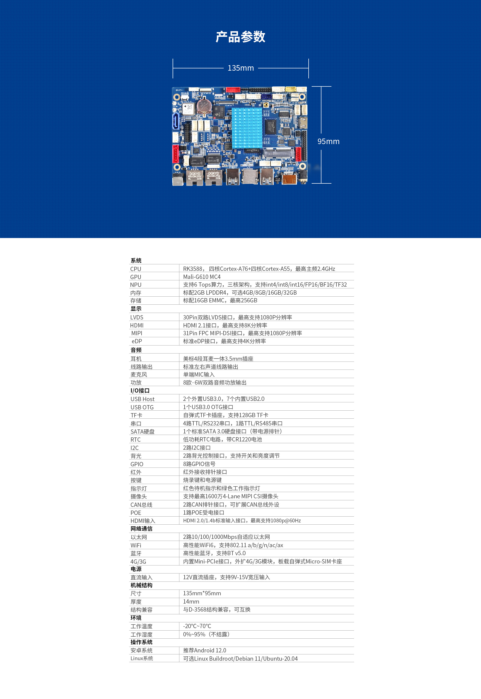
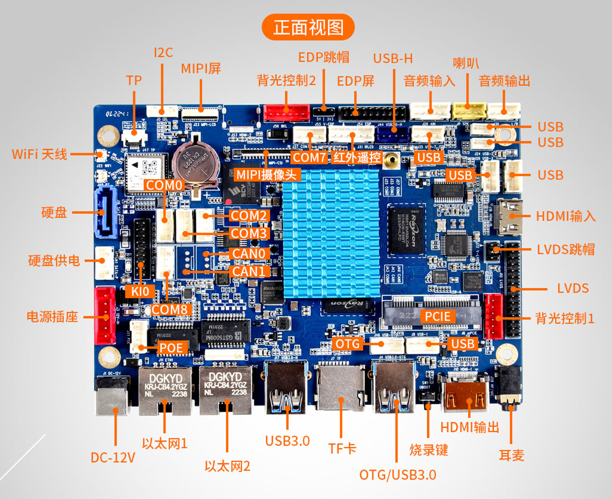
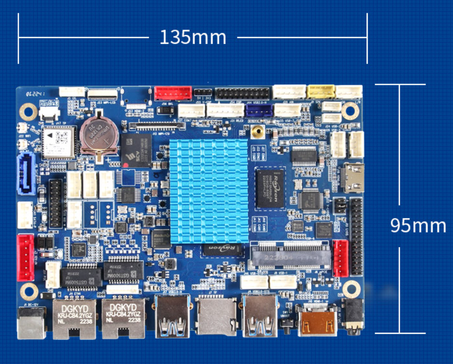
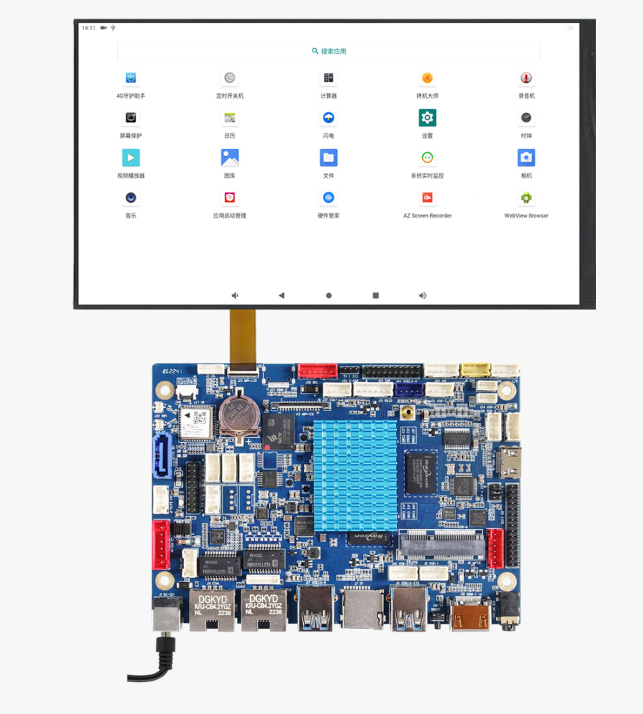
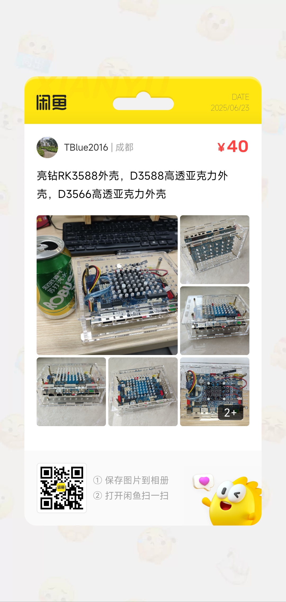

# D3588 (Rockchip RK3588) 玩耍记录


```
Something I hope you know before go into the coding~
First, please watch or star this repo, I'll be more happy if you follow me.
Bug report, questions and discussion are welcome, you can post an issue or pull a request.
```

## 相关站点

* 亮钻官网: <http://www.liontron.cn/showinfo-136-230-0.html>


## 开发板信息

```
Machine model: Rockchip RK3588 DXB LP4 V10 Board
```











## 高透亚克力外壳




* 外壳购买方式: 扫描上图二维码，跳转闲鱼购买
  - 高透亚克力材质
  - 支持2.5寸硬盘，预留孔位
  - 支持4cm/6cm散热风扇，预留孔位
  - 长165mm 宽110mm 高61.6mm 厚度5mm
  - 带m3铜柱，结实稳固
  - 预留ttl串口调试线孔位


---
